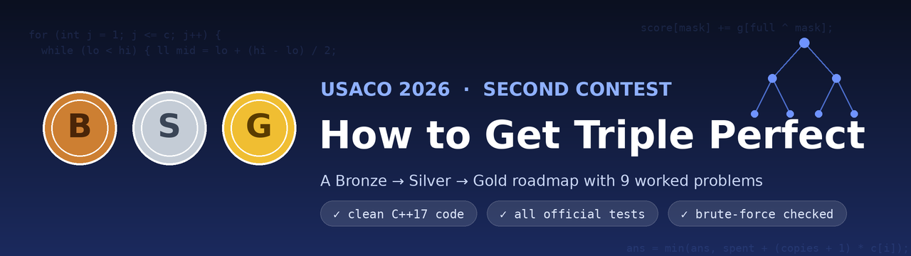

<div align="center">



# How to Get a Triple Perfect on USACO

**A Bronze → Silver → Gold roadmap, worked through on the USACO 2026 Second Contest: nine problems, clear explanations, clean C++17 solutions, all checked against the official test data.**


[🎯 What is it?](#-what-is-a-triple-perfect) · [🗺️ Roadmap](#-the-roadmap) · [🥉 Bronze](bronze/) · [🥈 Silver](silver/) · [🥇 Gold](gold/) · [🧪 How it's verified](#-how-its-verified) · [🚀 Quick start](#-quick-start)

</div>

---

## Why this repo?

Most contest repos are a pile of code. This one is a **guide to the goal**: it walks through a full Bronze, Silver and Gold set so you can see what "perfect in every division" actually demands. For every problem you get the *one key insight* that unlocks it, the reasoning behind the algorithm, the pitfalls that cost points, and a short, commented solution you can read in a few minutes. Solutions are written for clarity first and verified for correctness, so you can trust what you learn from them.

**Good for:** students moving Bronze → Silver → Gold, coaches looking for worked examples, and anyone who wants to see *how* to test a solution properly.

## 🎯 What is a triple perfect?

"Triple perfect" is community slang, not an official USACO title. It means scoring **1000 / 1000 in Bronze, Silver and Gold**, all three divisions, by solving every problem in each. USACO lets a strong contestant move up **within the same contest**: once you reach the promotion score in a division you can accept the promotion and start the next division's problems, so a single contest can take you from Bronze through Gold if you keep scoring high.

It is hard because each division needs a different skill:

| Division | What it rewards |
|----------|-----------------|
| 🥉 Bronze | Clean thinking, brute force done well, spotting identities (Bronze 1), bitmasks and greedy (Bronze 2-3) |
| 🥈 Silver | Reducing a story to a precise claim, amortised analysis, two pointers (Silver 1-3) |
| 🥇 Gold | Binary search with convexity, automata-style reasoning, graph structure (Gold 1-3) |

## 🗺️ The roadmap

1. **Master the fundamentals until they are automatic.** Sorting, prefix sums, BFS/DFS, binary search, bitmasks. Bronze and Silver points are lost to bugs far more often than to missing ideas.
2. **Practise on past contests, timed.** Do a full division in the real time limit, then read the write-ups here and the official analysis.
3. **Learn to test.** Write a brute force and a random generator for every problem ([`tools/stress.py`](tools/stress.py) shows how). Most wrong answers on hard problems are caught this way in minutes.
4. **Grab partial credit deliberately.** Every problem has subtasks; a correct slower solution beats an unfinished perfect one.
5. **Think about overflow and edge cases before you submit.** Gold 1 needs 128-bit arithmetic; Gold 3 needs iterative traversals; Silver 1 has a tiny-circle edge case.
6. **Review every problem you miss.** Write down the *one insight* you lacked. The write-ups in this repo use exactly that format.

> **Play by the rules.** USACO requires you to compete alone, use only language documentation, and not use AI tools, prewritten code or templates, or more than one account. A score only means something if it is earned this way, and violations can lead to disqualification. Use this repo to **learn before or after** a contest, never during one.

## 📚 The problems

Official contest page: [USACO 2026 Second Contest results](https://usaco.org/index.php?page=season26contest2results) (statements, analyses and test data).

| Div | # | Problem | Key idea | Time | Write-up | Code |
|:---:|:-:|---------|----------|:----:|:--------:|:----:|
| 🥉 | 1 | It's Mooin' Time IV | Suffix XOR is invertible → always YES | O(N) | [notes](bronze/1-mooin-time-iv/) | [cpp](bronze/1-mooin-time-iv/solution.cpp) |
| 🥉 | 2 | Moo Hunt | Bitmask boards + subset-sum (SOS) DP | O(N²·2ᴺ) | [notes](bronze/2-moo-hunt/) | [cpp](bronze/2-moo-hunt/solution.cpp) |
| 🥉 | 3 | Purchasing Milk | Normalise prices, greedy on binary | O(N+31Q) | [notes](bronze/3-purchasing-milk/) | [cpp](bronze/3-purchasing-milk/solution.cpp) |
| 🥈 | 1 | Cow-libi 2 | Claims mean "same owner?" → cyclic bit string | O(N) | [notes](silver/1-cow-libi-2/) | [cpp](silver/1-cow-libi-2/solution.cpp) |
| 🥈 | 2 | Declining Invitations | Amortised repair chains + monotone pointers | O(N+C+Σnᵢ) | [notes](silver/2-declining-invitations/) | [cpp](silver/2-declining-invitations/solution.cpp) |
| 🥈 | 3 | Farmer John Loves Rotations | Circle walk `l+r+min(l,r)`, two pointers + deques | O(N) | [notes](silver/3-fj-loves-rotations/) | [cpp](silver/3-fj-loves-rotations/solution.cpp) |
| 🥇 | 1 | Balancing the Barns | Binary search + convex inner search, `__int128` | O(N·log²) | [notes](gold/1-balancing-the-barns/) | [cpp](gold/1-balancing-the-barns/solution.cpp) |
| 🥇 | 2 | Lexicographically Smallest Path | Greedy word over vertex sets, ≤ 26 phases | O(26(N+M)) | [notes](gold/2-lex-smallest-path/) | [cpp](gold/2-lex-smallest-path/solution.cpp) |
| 🥇 | 3 | The Chase | Rests first; rotating frame on the cycle | O(N) | [notes](gold/3-the-chase/) | [cpp](gold/3-the-chase/solution.cpp) |

## 🧠 Techniques you'll practise

| Technique | Where |
|-----------|-------|
| Parity / XOR identities, difference arrays | Bronze 1 |
| Bitmask enumeration, SOS (subset-sum) DP | Bronze 2 |
| Greedy with a normalised cost structure | Bronze 3 |
| Reducing a story to a clean combinatorial claim | Silver 1 |
| Offline processing, amortised analysis, monotone pointers | Silver 2 |
| Two pointers, sliding-window minimum on a circle | Silver 3 |
| Binary search on the answer, convexity, 128-bit arithmetic | Gold 1 |
| Automata / subset simulation, parity BFS | Gold 2 |
| Functional graphs, multi-source BFS, modular "frames" | Gold 3 |

## 🚀 Quick start

```bash
git clone https://github.com/<your-username>/<this-repo>.git
cd <this-repo>

# compile and run one solution
g++ -O2 -std=c++17 -o moo bronze/2-moo-hunt/solution.cpp
./moo < bronze/2-moo-hunt/samples/1.in

# run every solution on the bundled samples
./tools/run_samples.sh
```

Requirements: a C++17 compiler (`g++`) and Python 3.8+ for the tools. No other dependencies.

## 🧪 How it's verified

Each solution was checked in two independent ways.

**1. Official test data.** Every solution passes **all** official test cases (9 of 9 problems). `tools/check_official.py` runs a solution on a folder of `N.in` / `N.out` files; for the two problems with many valid answers (Bronze 1 and Silver 1, which print a construction) it *simulates* the printed answer instead of diffing it. Slowest official case per problem (worst of two runs in a sandbox; your machine will differ, and USACO's limits are several seconds):

| Problem | B1 | B2 | B3 | S1 | S2 | S3 | G1 | G2 | G3 |
|---|:-:|:-:|:-:|:-:|:-:|:-:|:-:|:-:|:-:|
| Slowest case | 0.01 s | 0.35 s | 0.01 s | 0.02 s | 0.15 s | 0.13 s | 0.34 s | 0.11 s | 0.12 s |

**2. Brute-force stress tests.** `tools/stress.py` compares every solution with a slow, obviously-correct brute force on hundreds of random tiny inputs (all boards, all seatings, BFS over states, full state-space search for The Chase, and so on). The harness itself was mutation-tested: deliberately broken solutions are caught within a few random tests.

```bash
python3 tools/stress.py all          # 300 random tests per problem
python3 tools/stress.py gold3 1000   # one problem, more tests
```

To run the official data yourself, download a problem's test-data zip from the link in its README, unzip it into a folder, then:

```bash
python3 tools/check_official.py gold3 path/to/gold3_data
```

## 🗂️ Repository layout

```
.
├── bronze/ silver/ gold/
│   └── <n>-<problem>/
│       ├── README.md       idea, algorithm, pitfalls, takeaway
│       ├── solution.cpp    commented reference solution
│       └── samples/        sample inputs/outputs from the statement
├── tools/
│   ├── check_official.py   run against official data (with validators)
│   ├── stress.py           brute-force + random-test comparison
│   └── run_samples.sh      run all samples
└── assets/                 banner and social-preview images
```

## 📖 How to get the most out of it

1. Read the statement on USACO and **try it yourself first**, at least 20-30 minutes.
2. If stuck, read only the *Key insight* section of the write-up and try again.
3. Compare with the solution, then run the stress test on your own version.
4. Read the [official analysis](https://usaco.org/index.php?page=season26contest2results) too: seeing two explanations of the same problem is a great way to learn.

## 🤝 Contributing

Found a bug, a clearer explanation, or an alternative approach? Issues and pull requests are welcome. Good contributions include a failing test case, a simpler proof, or a solution in another language. Please keep solutions readable and include a brute-force check when adding a new problem.

## ⚖️ Credits and licence

- Problem statements, official analyses and test data belong to [USACO](https://usaco.org) and their authors (this contest's problems are credited to Nick Wu, Alex Liang, Chongtian Ma, Rohin Garg, Daniel Zhu, Yash Belani and Benjamin Qi). This repository **links to** them and does not redistribute the statements or test data; the small `samples/` files are the examples printed in the statements.
- The explanations, solutions and tools in this repository are released under the [MIT License](LICENSE).
- This is an independent educational project and is not affiliated with USACO.

<div align="center">

If this roadmap helped you, a ⭐ helps other students find it.

</div>
